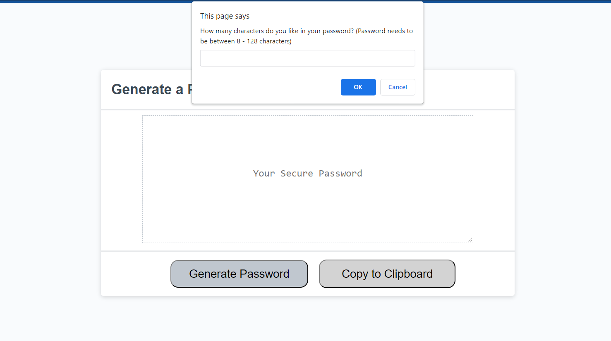
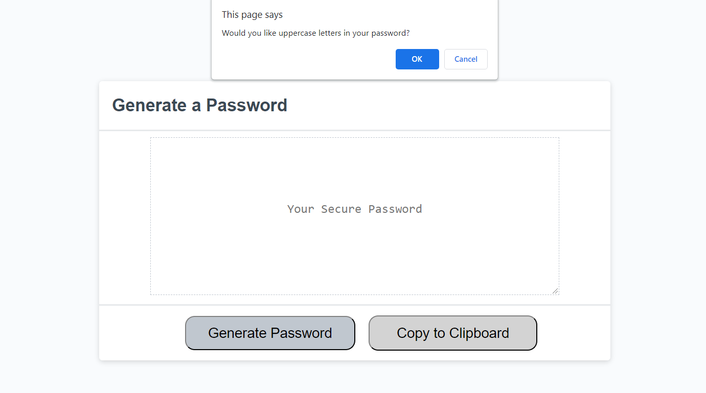
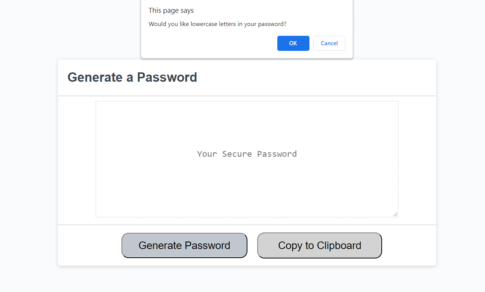
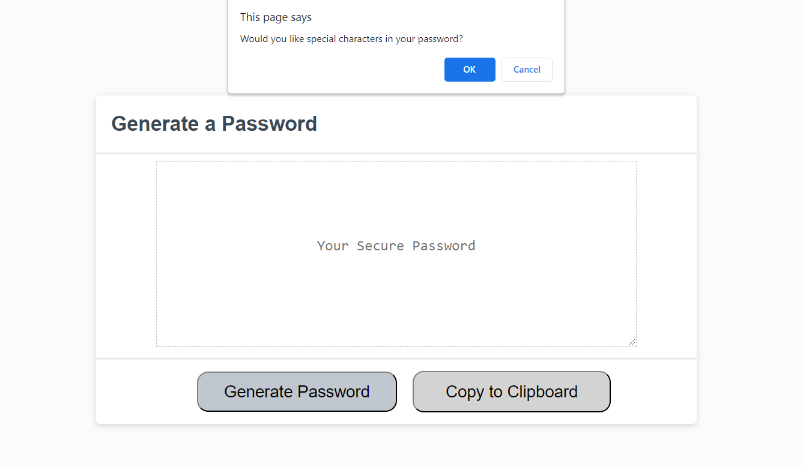
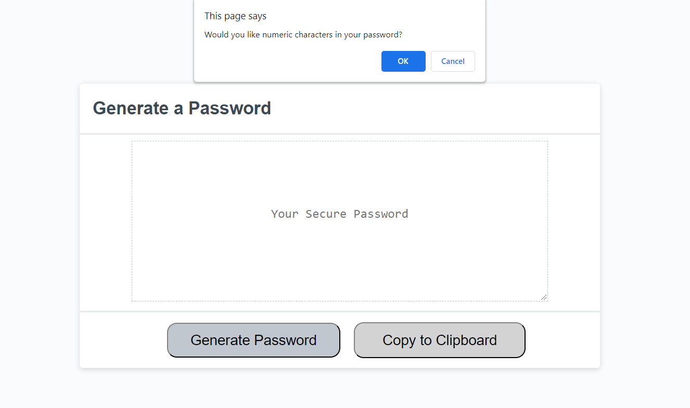
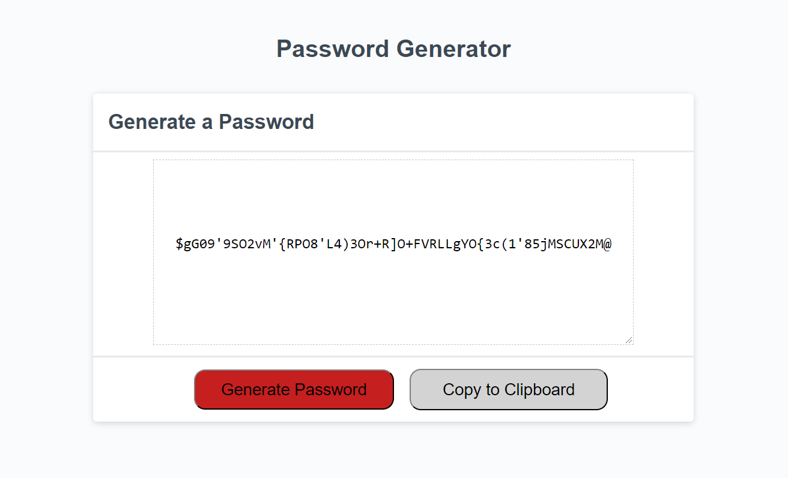

# Password-Generator

(Homework-3: Intro to Javascript: Password Generator)

 

## Project Description: 

Odd numbered week homework assignment. Develop given code prompts to generate a random characters password with options for upperCase, lowerCase, symbols, and numbers.

  

## Table of Contents:

 

- [Installation] (#installation)
- [Usage] (#usage)
- [Credits] (#credits)
- [License] (#license)
- [Badges] (#badges)
- [Features] (#features)
- [How] (#how to contribute)
- [Criteria] (#criteria's met)
- [HTML] (#html - details)
- [CSS] (#css - details)
- [URL] (#url (github repository))
- [URL] (#url (published webpage))

 

## Installation
 
** Go to <a href="https://jasonjayoo.github.io/password-generator" target="_blank">Password-Generator</a> In order to view the Password Generator Webpage.

 
 

## Usage: screenshots - (Highlighted Title(s) = a hyperlink to the direct image)

 
 

[Screenshot1](images/Screenshot1.png)  "Main Page"

 

[Screenshot2](images/Screenshot2.png)  "Password Length Prompt"

 

[Screenshot3](images/Screenshot3.png)  "Uppercase Selection Prompt"

 

[Screenshot4](images/Screenshot4.png)  "Lowercase Selection Prompt"

 

[Screenshot5](images/Screenshot5.png)  "Symbol Selection Prompt"

 

[Screenshot6](images/Screenshot6.png)  "Number Selection Prompt"

 

[Screenshot7](images/Screenshot7.png)  "Example Generated Password"

 
 

## Credits:

- I would like to thank my tutor Mr. Faran Navazi for being an instrumental help in teaching me about javascript. 

 
 

## License:
 
    -  Non applicable as of this time
 
 

## Badges:
 
    - UCI Full Stack Bootcamp
 
 

## Features:
 
    - Generate password button when clicked will display a prompt.
    - Users must select a password length between 8-128          characters in order to continue generating a password.
    - Once a number of characters has been placed by the user the prompt will ask if the user would like to include upperCase characters, lowerCase characters, special(symbol) characters and numeric characters.
    - once all of the characters have either been selected or not selected (at least one must be selected in order for a password to be generated or the default placeholder of "your secure password" will appear in the center text area.). A randomly generate password will appear in the center text area.
 
 

## How to Contribute:
 
    - My github repository is publically viewable. If you would to contribute to the webpage please email me at jasonjayoo@outlook.com with the request and I will add you as a contributor on the repo. 
 
 

## Tests:
 
    - Test the password coding by generating a random password! Have fun. 
     
    - You can test out the webpage on vsc or directly in the inspect window of your browser. 

 
 

## Criteria's met: 

 

1. The password generator styling and display is a carbon copy of the demo provided in the homework folder.  
2. The generate password button will deploy a prompt for the users to select customized options
3. The password length as specified was set to a minimum of 8 characters and a maximum of 128 characters. Anything outside those parameters will be kicked back to the original password length prompt. 
4. When a character length between 8 and 128 has been added by the user the display prompt will ask if the user would like to include:
  
             a). Uppercase Character
         
             b). Lowercase Character
         
             c). Special (symbol) Character
         
             d). Numeric Character
         
         
        * [ok] means include, [cancel] means do not include. 

5. Once all the options have been run a random password will be generated and displayed in the center text area.

 
 

## HTML - Details:

 

1. The base html format needed very few changes.
2. The only addition/change made to the original html was the addition of a second button designated as "copy to clipboard" that was placed to the right of the "generate password" button.

 
 

## CSS - Details:

 

1. The main changes in the given CSS was the addition of the second button "copy to clipboard" and its stylization
2. The "generate password" button's border was given detailed stylization to appear like that in the mock demo provided.
3. The "generate password" button's color was changed to red and the text color changed to black. The padding was slightly altered to adjust for the difference in text length of button1 and button2
4. Button hover added so background of the buttons would change color when users hovered the cursor over the button.
5. Password id's width was changed along with the top and bottom padding so it would look like the mock demo provided.
6. The border of the password id was also changed to dashed.

 
 

## JS - Details:

 

1. Variables for the specialCharacters, numericCharacters, lowerCased Characters, and upperCased Characters were placed in the global scope at the very top.
2. Under the generate password function variables for holding the results of the possible password characters for the four different options was created 
3. Under the same generate password function a variable for the results for the randomChar generated by the possible password variable was created so the results of the randomChar could be 'returned'.
4. Variable for the length of password characters was created with parseInt and prompt to generate and return an integer.
5. if created to set length requirement of the password to be between 8 and 128 characters.
6. var confirmation prompt for uppercase, lowercase, special and numbers created for users with if === true for each, so that users can choose either to include or not include the options. If none were chosen the default placeholder would appear in the center text area instead of a randomly generate password.
7. var randomindex set to math.floor with math.random to generate a numeric value of the select character(s).
8. var randomChar added so the selected option by the user will be pushed up to the 'possiblePassword' variable.
7. return results set with .join to remove the '' and set the randomly generate password into one line of text. 
8. function writePassword set to display generatePassword results. 
9. passwordtext set with .value to be var password and the passwordtext document.queryselector set to be displayed via the html under the id of password so the randomly generate password will be displayed in the center text area.

 
 

## URL (Github Repository):

Click [here](https://github.com/jasonjayoo/password-generator) to go to the Password-Generator Github Repository

 

## URL (Published Webpage):

<a href="https://jasonjayoo.github.io/password-generator/" target="_blank">Password-Generator</a>

